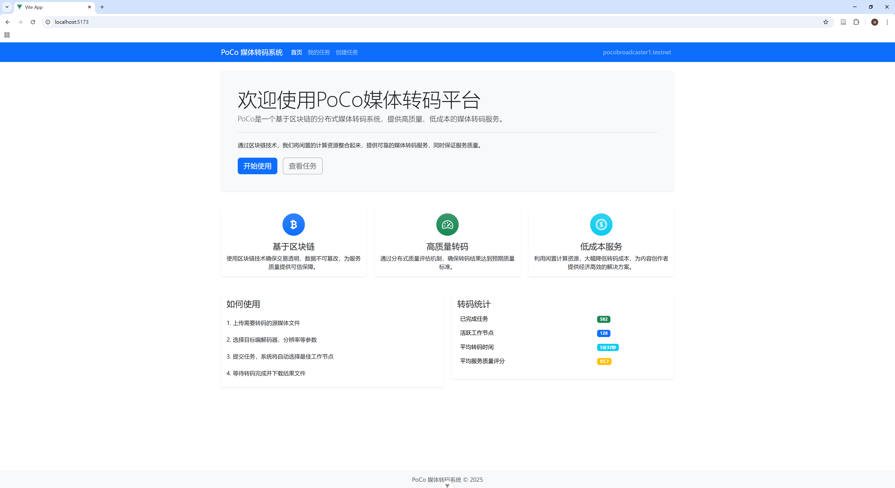
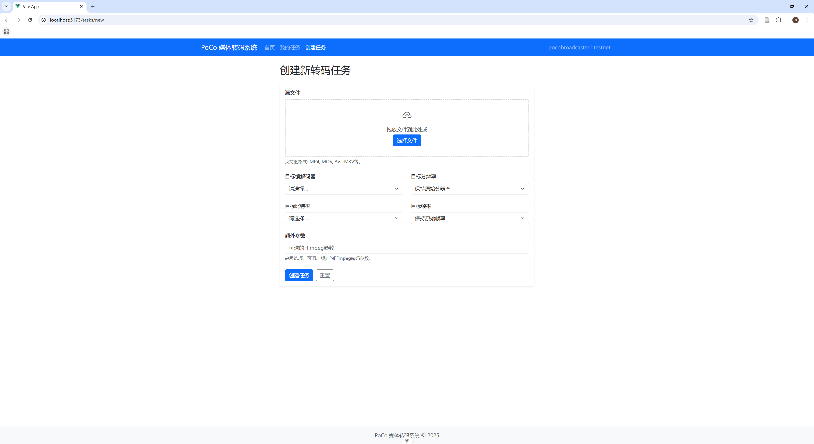
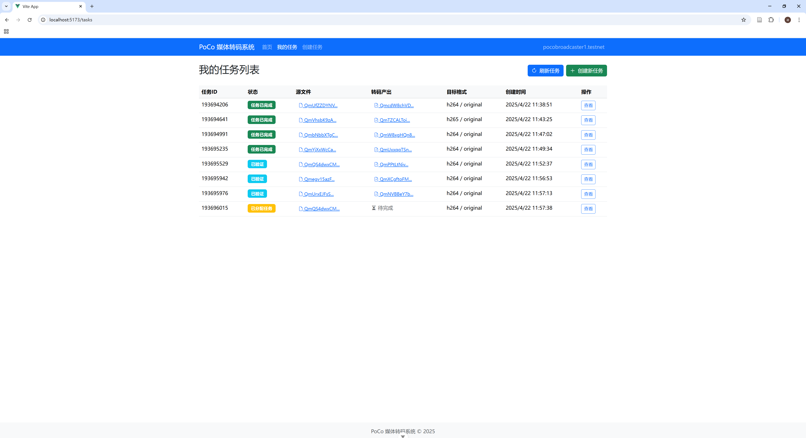
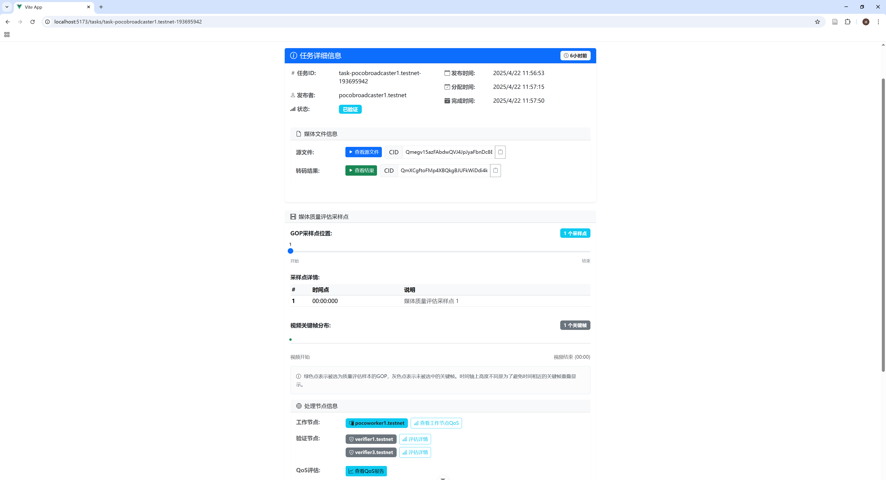
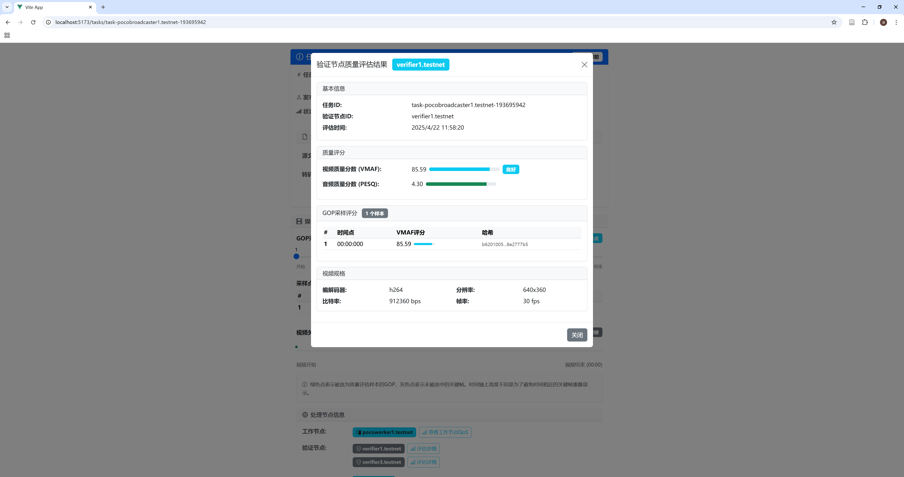
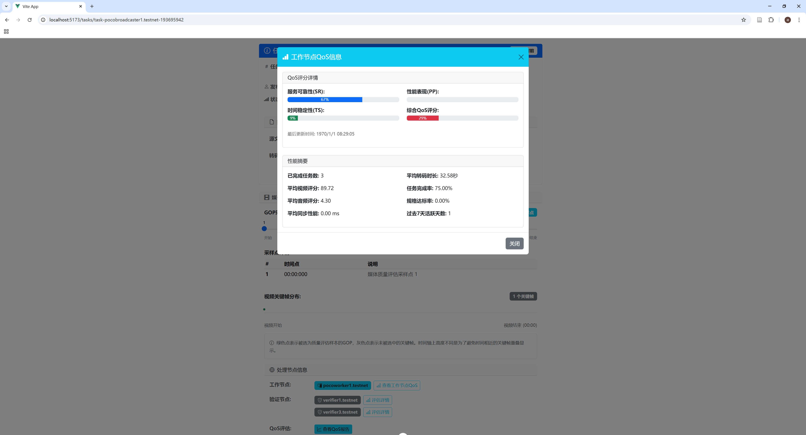

## Architecture
The PoCo Broadcaster Module is a client application for content creators to submit, monitor, and manage media transcoding tasks in a decentralized blockchain-based transcoding network. It provides a user-friendly interface for interacting with the PoCo ecosystem, ensuring transparent quality-assured media transcoding services.

                ┌───────────────────┐
                │ Broadcaster Module│
                └─────────┬─────────┘
                          │
              ┌───────────┴────────────┐
              │                        │
    ┌─────────▼──────────┐   ┌─────────▼──────────┐
    │   Vue.js Frontend  │   │  Backend Services  │
    │                    │   │                     │
    │ - User Interface   │   │ - Express Server   │
    │ - Task Management  │   │ - API Endpoints    │
    │ - QoS Monitoring   │   │ - File Handling    │
    └─────────┬──────────┘   └─────────┬──────────┘
              │                        │
    ┌─────────▼──────────┐   ┌─────────▼──────────┐
    │  Service Modules   │   │ Blockchain Connect │
    │                    │   │                    │
    │ - IPFS Service     │   │ - NEAR Integration │
    │ - API Service      │   │ - Contract Calls   │
    │ - Task Monitoring  │   │ - Account Auth     │
    └─────────┬──────────┘   └─────────┬──────────┘
              │                        │
              └──────────┐ ┌───────────┘
                         │ │
               ┌─────────▼─▼────────┐
               │ QoS Visualization  │
               │                    │
               │ - Quality Reports  │
               │ - Worker Stats     │
               │ - GOP Analysis     │
               └────────────────────┘


The Broadcaster Module consists of the following core components:

### 1.Frontend Application: Vue.js-based SPA with comprehensive task management interface

- Task creation and submission workflow
- Real-time task status monitoring
- Quality of Service (QoS) visualization dashboard
- Worker performance analysis


### 2.Service Layer: Facilitates communication between frontend and backend

- api-service.ts: Handles API requests to the backend server
- ipfs-service.ts: Manages file uploads and retrieval from IPFS
- near-service.ts: Provides blockchain interaction capabilities


### 3.Backend Server: Express.js server with API endpoints for:

- File uploads to IPFS
- Task management on blockchain
- QoS report retrieval
- Worker selection and verification


### 4.NEAR Blockchain Integration: Connects to the PoCo smart contracts

- Task publication and monitoring
- Worker selection based on QoS metrics
- Verification orchestration
- Quality consensus management


### 5.IPFS Integration: Decentralized storage for media files

- Source file uploads
- Transcoded file retrieval
- Temporary GOP samples for verification

## Using the Broadcaster Interface

### Dashboard Overview
<p align="center">
  
  <br>
  <em>Figure1: Dashboard Overview</em>
</p>


### Creating a Transcoding Task

<p align="center">
  
  <br>
  <em>Figure2: Creating a Transcoding Task</em>
</p>


### Monitoring Tasks

<p align="center">
  
  <br>
  <em>Figure3: Monitoring Tasks</em>
</p>

<p align="center">
  
  <br>
  <em>Figure4: Monitoring Tasks</em>
</p>


### Viewing Quality Reports

<p align="center">
  
  <br>
  <em>Figure5: Viewing Quality Reports</em>
</p>


### Worker Performance Analysis

<p align="center">
  
  <br>
  <em>Figure6: Worker Performance Analysis</em>
</p>

## usage
Prerequisites
```bash
Node.js 18+ and npm
NEAR CLI installed and configured
Access to IPFS node (local or remote)
NEAR testnet or mainnet account
```

## Workflow
The PoCo Broadcaster follows a robust workflow for managing transcoding tasks:

### Task Creation Phase

1. User uploads source media to IPFS through the interface
2. System generates a unique content identifier (CID)
3. User specifies transcoding parameters:

- Target codec (H.264, H.265, VP9, AV1)
- Resolution (1080p, 720p, etc.)
- Bitrate and framerate settings
- Additional encoding parameters


4. Task is published to blockchain with requirements and IPFS reference


### Worker Selection Phase

- Blockchain contract accepts bids from qualified worker nodes
- Workers are filtered based on QoS history and capabilities
- Broadcaster can view worker profiles and QoS metrics


### Task Monitoring Phase

- Real-time status updates via blockchain events
- Visualization of task progress and assignment details
- Automatic notifications of status changes


### Quality Verification Phase

- System assigns verifier nodes to evaluate transcoding quality
- GOP-based sampling approach for efficient quality assessment
- Multiple quality metrics evaluated (VMAF, PESQ, sync)
- Consensus mechanism ensures reliable QoS reporting


### Result Retrieval Phase

- Completed task provides IPFS link to transcoded media
- User can preview or download result directly through interface
- Comprehensive QoS report display
- Worker performance metrics are updated

## Implementation Details
### IPFS Service

The IPFS Service handles file uploads and retrieval operations:

```typescript
export class IPFSService {
  private config: BroadcasterConfig;
  private ipfs: IPFSHTTPClient;
  
  constructor(config: BroadcasterConfig) {
    this.config = config;
    this.ipfs = create({
      host: config.ipfsConfig.host,
      port: config.ipfsConfig.port,
      protocol: config.ipfsConfig.protocol
    });
  }

  async uploadFile(file: File): Promise<string> {
    try {
      console.log(`Starting file upload to IPFS: ${file.name}, size: ${file.size} bytes`);
      
      // Upload file to IPFS
      const added = await this.ipfs.add(file, {
        progress: (prog) => console.log(`Upload progress: ${prog} / ${file.size}`)
      });
      
      console.log(`File upload successful, CID: ${added.cid.toString()}`);
      return added.cid.toString();
    } catch (error) {
      console.error('Failed to upload file to IPFS:', error);
      throw error;
    }
  }

  getFileUrl(cid: string): string {
    return `${this.config.ipfsConfig.gateway}/ipfs/${cid}`;
  }
}
```

### Smart Contract Interface

The Broadcaster interfaces with the PoCo smart contract through a comprehensive API:

```typescript
// Initialize contract with view and change methods
this.contract = new Contract(nearAccount, NEAR_CONFIG.contractId, {
  viewMethods: [
    "get_available_tasks",
    "get_task",
    "get_consensus_proof",
    "get_task_consensus_details",
    "get_worker_info",
    "get_worker_qos_score",
    "get_worker_performance_summary",
    "get_task_offers",
    "get_worker_daily_stats",
    "get_task_queue",
    "get_broadcaster_tasks",
    "get_worker_qos_details",
    "get_verifier_proof",
  ],
  changeMethods: [
    "publish_task",
    "select_and_assign_verifiers",
    "request_supplemental_verifier",
    "check_offer_timeout",
    "check_broadcaster_offer_timeout",
    "complete_task",
  ],
  useLocalViewExecution: false,
});
```


### Task Creation Process
The task creation component demonstrates the complete workflow:
```typescript
// Task creation workflow
const submitForm = async () => {
  try {
    isSubmitting.value = true;
    
    // Step 1: Upload file to IPFS
    console.log('Starting file upload to IPFS...');
    const cid = await fileUploader.value.uploadFile();
    console.log(`File upload successful, obtained CID: ${cid}`);
    
    // Step 2: Build transcoding requirements object
    const requirements: TranscodingRequirement = {
      target_codec: form.targetCodec,
      target_resolution: form.targetResolution,
      target_bitrate: form.targetBitrate,
      target_framerate: form.targetFramerate,
      additional_params: form.additionalParams
    };
    
    console.log('Preparing to create task, parameters:', {
      sourceIpfs: form.sourceIpfs,
      requirements
    });
    
    // Step 3: Create task on blockchain
    const taskId = await tasksStore.createTask(form.sourceIpfs, requirements);
    
    console.log('Task creation successful, task ID:', taskId);
    
    // Show success message
    appStore.setAlert({
      type: 'success',
      message: `Task creation successful, task ID: ${taskId}`,
      timeout: 3000
    });
    
    // Reset form and redirect
    resetForm();
    router.push('/tasks');
    
  } catch (error) {
    console.error('Task creation failed:', error);
    // Error handling
  }
};
```

### Quality of Service Visualization

The Broadcaster provides detailed QoS metrics visualization:

```typescript
// QoS display component
const getVmafScoreClass = (score) => {
  if (score >= 90) return 'bg-success';
  if (score >= 70) return 'bg-info';
  if (score >= 50) return 'bg-warning';
  return 'bg-danger';
};

// GOP sample visualization
const isSampledGop = (timestamp) => {
  if (!task.value || !task.value.selected_gops) return false;
  return task.value.selected_gops.includes(timestamp);
};

// Timeline position calculation
const calculatePosition = (timestamp, totalDuration) => {
  const seconds = parseFloat(timestamp);
  if (isNaN(seconds) || totalDuration <= 0) return 0;
  return (seconds / totalDuration) * 100;
};
```

### Task Monitoring System
The task monitoring system includes real-time status tracking:

```typescript
// Task status monitoring
static async monitorTaskStatus(
  taskId: string,
  onStatusChange: (oldStatus: string, newStatus: string, task: TaskData) => void,
  interval: number = 5000,
  maxAttempts: number = 12
): Promise<void> {
  let attempts = 0;
  let lastStatus = '';

  const checkStatus = async () => {
    if (attempts >= maxAttempts) return;

    try {
      const task = await this.getTask(taskId);

      if (lastStatus && task.status !== lastStatus) {
        onStatusChange(lastStatus, task.status, task);
      }

      lastStatus = task.status;

      // Stop polling if task has progressed beyond queue/offer collection
      if (task.status !== TaskStatus.OfferCollecting && 
          task.status !== TaskStatus.Queued) {
        return;
      }

      attempts++;
      setTimeout(checkStatus, interval);
    } catch (error) {
      console.error(`Task status monitoring failed: ${error}`);
      attempts++;
      setTimeout(checkStatus, interval);
    }
  };

  // Start first check
  await checkStatus();
}
```