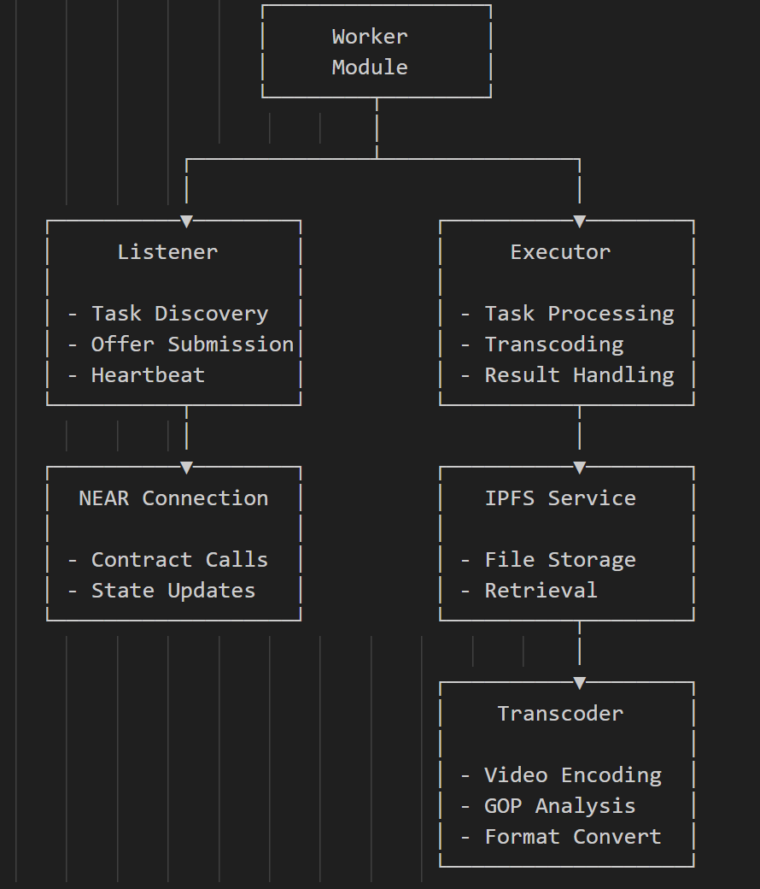

# POCO Worker Module

## Architecture

The POCO Worker Module implements a distributed transcoding worker node that connects to the blockchain-based media transcoding system. It consists of the following core components:

<p align="center">
  
  <br>
  <em>Figure1: Worker Components</em>
</p>

The system comprises five main components:

1. **Listener**: Monitors blockchain for tasks, manages worker registration, and sends heartbeats
2. **Executor**: Processes queued tasks, handles transcoding workflow, and manages results
3. **NEAR Connection**: Handles all blockchain interactions with the transcoding contract
4. **IPFS Service**: Manages file uploads/downloads to/from IPFS for source and result files
5. **Transcoder**: Performs actual media transcoding using FFmpeg and extracts metadata

## Usage

```
npm run dev
```

## Workflow

The POCO Worker follows a specific workflow to participate in the decentralized transcoding network:

1. **Initialization Phase**
   - Connect to NEAR blockchain network
   - Register worker if not already registered
   - Connect to IPFS for file storage
   - Initialize transcoding capabilities
   - Create local directories for queue and task storage

2. **Task Discovery Phase**
   - Send periodic heartbeats to maintain availability
   - Poll blockchain for available tasks
   - Submit offers for suitable tasks
   - Accept queued tasks automatically assigned by contract

3. **Task Processing Phase**
   - Download source media from IPFS
   - Perform transcoding according to task requirements
   - Extract keyframe timestamps and video metadata
   - Upload result to IPFS
   - Submit completion proof with GOP information

4. **Result Reporting Phase**
   - Submit completed task with result CID
   - Provide keyframe timestamps for verification
   - Include video duration and frame count
   - Clean up temporary files

5. **Status Management Phase**
   - Maintain local task state
   - Track active tasks to manage resources
   - Handle graceful shutdown for in-progress tasks

## Implementation Details

### Listener Component

The Listener acts as the bridge between the blockchain and local worker:

```typescript
class Listener {
  private nearConnection: NearConnection;
  private queueDir: string;
  private taskDir: string;
  private pollingInterval: number;
  private running: boolean = false;
  private activeTasks: Set<string> = new Set();
  private heartbeatInterval?: NodeJS.Timeout;

  // Methods for task discovery and queue management
  async pollTasks(): Promise<void> {
    // Get worker status and available tasks
    const taskCollection = await this.nearConnection.getTasksForWorker();
    
    // Process assigned tasks first
    // Then handle queued tasks
    // Finally submit offers for available tasks if resources permit
  }
  
  // Queue management methods
  private queueTask(task: TaskData): void {
    // Write task to local queue directory
  }
}
```

### Executor Component

The Executor handles the actual processing of transcoding tasks:

```typescript
class Executor {
  private nearConnection: NearConnection;
  private ipfsService: IPFSService;
  private transcoder: Transcoder;
  private queueDir: string;
  private taskDir: string;
  private tempDir: string;
  private pollingInterval: number;
  private maxConcurrentTasks: number;
  private running: boolean = false;
  private activeTasks: Set<string> = new Set();
  
  // Core task processing method
  private async processTask(task: TaskData): Promise<void> {
    // Download source file from IPFS
    // Perform transcoding
    // Extract keyframe timestamps
    // Get video duration and frame count
    // Upload result to IPFS
    // Report completion to blockchain
    // Clean up temporary files
  }
}
```

### Transcoder Component

The Transcoder wraps FFmpeg to handle media encoding:

```typescript
typescriptclass Transcoder {
  // Main transcoding method
  async transcode(
    inputPath: string,
    outputPath: string,
    requirements: TranscodingRequirement
  ): Promise<boolean> {
    // Generate FFmpeg command with appropriate parameters
    // Spawn FFmpeg process
    // Monitor progress
    // Return success/failure
  }
  
  // Extract keyframe timestamps for verification
  async extractKeyframeTimestamps(filePath: string): Promise<string[]> {
    // Use FFprobe to identify all keyframes
    // Return timestamps for GOP verification
  }
}
```

### NEAR Connection Component

Handles all blockchain interactions:

```typescript
typescriptclass NearConnection {
  private config: WorkerConfig;
  private nearConnection: any;
  private accountId: string;
  private contractId: string;
  private contract: any;
  
  // Contract interaction methods
  async completeTask(
    taskId: string,
    resultIpfs: string,
    keyframeTimestamps: string[],
    videoDuration: number,
    frameCount: number
  ): Promise<boolean> {
    // Submit completion to blockchain
    // Include metadata for verification
  }
  
  // Worker registration and heartbeat
  async sendHeartbeat(): Promise<WorkerStatus> {
    // Send heartbeat to maintain availability
    // Receive current worker status
  }
}
```

### IPFS Service Component

Manages IPFS file operations:

```typescript
class IPFSService {
  private apiUrl: string;
  
  // Upload result files
  async uploadFile(filePath: string): Promise<string> {
    // Create form data with file
    // Upload to IPFS
    // Return CID
  }
  
  // Download source files
  async downloadFile(cid: string, outputPath: string): Promise<string> {
    // Fetch file content from IPFS
    // Save to local filesystem
    // Return local path
  }
}
```

